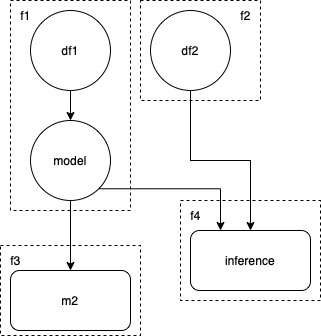

# Summary

Ray is a popular framework for distributed execution. This proposal explores how we could use LineaPy pipelines 
to automatically leverage [Ray Workflow DAGs](https://docs.ray.io/en/master/workflows/basics.html) in a data
science script that does not already use Ray.

## General Motivation

To help data scientists leverage Ray DAGS could mean speeding up executions 
and unlocking data of new scale.

It may not be easy to use Ray, as the data scientists have to learn a new framework, and develop a mental model for when 
to use the distributed tasks and actors. If we could automate the majority of the reasoning with logic over the LineaPy pipeline, 
we could lower the barrier to entry.

## Motivating and Specifying Examples

Imagine if we have the following data science workflow

```python
def foo():
    ...
    
def bar():
    ...

def train(data):
    ...

def infer(model, data):
    ...

df1 = foo()
df2 = bar()
model = train(df1)
m2 = copy.deepcopy(model)
inference = infer(model, df2)
```

LineaPy can automatically generate a set of modules and a pipeline that connects them as follow:

### Modules
```python
def f1():
    df1 = foo()
    model = train(df1)
    return model
    
def f2():
    df2 = bar()
    return df2

def f3(model):
    m2 = copy.deepcopy(model)
    return m2

def f4(model, data):
    inference = infer(model,data)
    return inference

```

### Pipeline
```python
def pipeline():
  model = f1()
  data = f2()
  model_copy = f3(model)
  inference = f4(model, data)
```

Which would look like this


